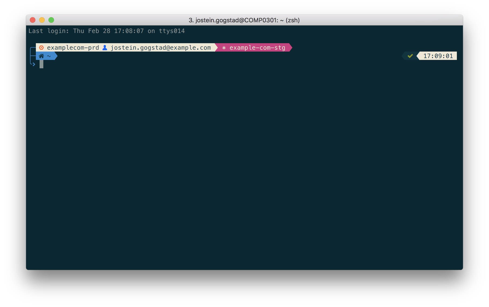

# Powerlevel9k GCP

_This repository is superseded by the powerlevel10k out-of-the-box gcp support_

Show current GCP project and logged in user in your prompt. There's also an optimized version of the current kubernetes context segment (shown in pink below):



## Features

* Show the current GCP project in your prompt
* Visualize whether you're authenticated with a user account or a service account
* Faster implementation of the `kube_context` segment 

## Installation

Follow Powerlevel9k [installation instructions](https://github.com/bhilburn/powerlevel9k/wiki/Install-Instructions)

1. Your terminal needs to use a patched font with icons from Devicon and Font Awesome (alternatively you can disable icons, see [customization](#customization)). I suggest the brilliant [Meslo LG](https://github.com/andreberg/Meslo-Font). The screenshot above uses `13pt Meslo LG M Regular Nerd Font Complete`:
    ```bash
    brew tap caskroom/fonts
    brew cask install font-meslo-nerd-font
    ```
1. Source [powerlevel_gcp.zsh](./powerlevel_gcp.zsh) and [powerlevel_kubecontext.zsh](./powerlevel_kubecontext.zsh) in your ZSH configuration
    ```bash
    # If you're using oh-my-zsh
    curl -Lo "$HOME/.oh-my-zsh/custom/#1" "https://raw.githubusercontent.com/jgogstad/powerlevel-9k-gcp/master/{powerlevel_gcp.zsh}"
    curl -Lo "$HOME/.oh-my-zsh/custom/#1" "https://raw.githubusercontent.com/jgogstad/powerlevel-9k-gcp/master/{powerlevel_kubecontext.zsh}"
    
    # If not using oh-my-zsh, just make sure that the files are sourced 
    ```
Two new segments are now available: `gcp_project` and `gcp_user`, use them in `POWERLEVEL9K_LEFT_PROMPT_ELEMENTS` or `POWERLEVEL9K_RIGHT_PROMPT_ELEMENTS`. See the official [documentation](https://github.com/bhilburn/powerlevel9k#prompt-customization) or example below.   

## Example configuration

ZSH config for screenshot above. I suffix `gcp_user` with `_joined` to merge the two segments into one.

```bash
POWERLEVEL9K_MODE='nerdfont-complete'

POWERLEVEL9K_LEFT_PROMPT_ELEMENTS=(gcp_project gcp_user_joined kube_context newline context dir_writable dir root_indicator vcs)
POWERLEVEL9K_RIGHT_PROMPT_ELEMENTS=(status background_jobs time)

POWERLEVEL9K_PROMPT_ON_NEWLINE=true
POWERLEVEL9K_PROMPT_ADD_NEWLINE=true
POWERLEVEL9K_MULTILINE_FIRST_PROMPT_PREFIX="%F{blue}\u256D\u2500%f"
POWERLEVEL9K_MULTILINE_NEWLINE_PROMPT_PREFIX="%F{blue}\u251C\u2500%f"
POWERLEVEL9K_MULTILINE_LAST_PROMPT_PREFIX="%F{blue}\u2570\uf460%f "

## Context segment won't print for this user
DEFAULT_USER=$(whoami)
```

## Customization

You can customize the icons by changing the default values

```bash
POWERLEVEL9K_GCP_PROJECT_ICON="%F{202}\ue7b2"
POWERLEVEL9K_GCP_USER_ICON="%F{027}\uf415"
POWERLEVEL9K_GCP_SERVICE_ACCOUNT_ICON="%F{red}\uf013"
```

## Why not merge with upstream

These segments were developed for Powerlevel 6.x. The upstream powerlevel9k repository does not accept new segments to the main branch anymore. Once Powerlevel9k 7 is released, I'll make a PR for them. 

Read more at https://github.com/bhilburn/powerlevel9k/wiki/*Note-to-Contributors
